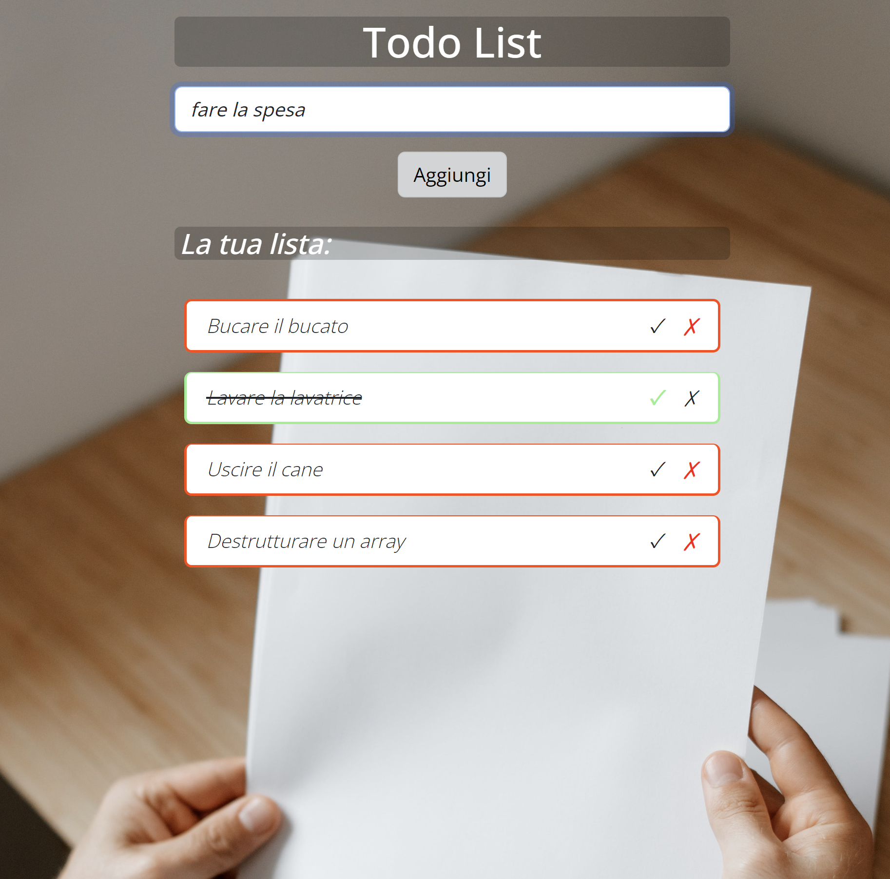

# Anteprima

---

# Esercizio

---

## Testo dell' Esercizio

Implementare una todolist base. Ogni todo è rappresentato come una stringa all'interno dell'array.
1. MILESTONE 1
Stampare all'interno di una lista, un item per ogni todo.
2. MILESTONE 2
Visualizzare a fianco ad ogni item una "x": cliccando su di essa, il todo viene rimosso dalla lista.
3. MILESTONE 3
Predisporre un campo di input testuale e un pulsante "aggiungi": cliccando sul pulsante, il testo digitato viene letto e utilizzato per creare un nuovo todo, che quindi viene aggiunto alla lista dei todo esistenti.

---

1. BONUS 1
Oltre al click sul pulsante, intercettare anche il tasto ENTER per aggiungere il todo alla lista
2. BONUS 2
Trasformare ogni todo in un oggetto, formato da due proprietà:
- text, una stringa che indica il testo del todo
- done, un booleano (true/false) che indica se il todo è stato fatto oppure no. Se done è true, mostrare il testo del todo sbarrato. Di conseguenza modificare la funzionalità di input in modo da aggiungere un nuovo oggetto alla lista invece della semplice stringa.
3. BONUS 3
Cliccando sul testo dell'item, invertire il valore della proprietà done del todo corrispondente (se done era uguale a false, impostare true e viceversa)

---

## Algoritmo di svolgimento

- Creo una variabile all' interno dei data della mia app che mi servira' come appoggio per assegnarle il valore dell' input dal form HTML tramite v-model.

- Aggiungo evento di click al bottone sottostante l' input per salvare il valore momentaneo della variabile v-model in un nuovo array.

- Apro un ciclo v-for per ogni elemento dell' array che creera' un elemento lista, inserisco il contenuto di testo tramite string interpolation.

- Aggiungo evento per il click del tasto 'Invio', utilizzo v-on.

- Modifico le proprieta' della variabile d' appoggio per l' input trasformandola in un oggetto, dunque tutto cio' a cui era precedentemente assegnata la variabile adesso verra' assegnato alla chiave 'name' dell' oggetto', l' altra chiave dell' oggetto sara' un flag di tasto settato di default su 'false'.

- Aggiungo un checkmark e un crossmark alla quale assegno un evento di click collegato alle funzioni di rimozione oggetto o evidenziazione di questo (come fosse una task svolta), singolo click su check: evidenzi in verde task svolta, barra il contenuto di testo, se il contenuto e' evidenziato e barrato crossmark lo fa tornare allo stato iniziale, stato iniziale con bordi rossi, se stato inziale crossmark elimina elemento dalla lista.